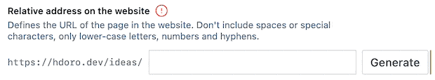

# sanity-plugin-prefixed-slug

Editor friendly slug fields for your Sanity.io studio. Prefixed URLs and auto-slugifying values.



## Installation

Start by enabling it in your Sanity V3 studio:

```bash
yarn add sanity-plugin-prefixed-slug
# or npm
npm i sanity-plugin-prefixed-slug
```

🚨 If you're using Sanity V2, use the `^1.0.0` releases of this plugin.

Then, use the custom input component in your `slug` field(s):

```js
import { SlugInput } from 'sanity-plugin-prefixed-slug'

export default {
  name: 'testing-slugs',
  type: 'document',
  fields: [
    {
      name: 'slug_regular_custom_input',
      type: 'slug',
      // Add the custom input to the `component` object of your field
      components: {
        input: SlugInput,
      },
      options: {
        source: 'title',
        urlPrefix: 'https://site.url',
        // Use isUnique/maxLength just like you would w/ the regular slug field
        isUnique: MyCustomIsUniqueFunction,
        maxLength: 30,
        // If you want to save the full URL in the slug object, set storeFullUrl to `true`
        // Example storage: { _type: "slug", current: "my-slug", fullUrl: "https://site.com/my-slug" }
        storeFullUrl: true,
      },
    },
    {
      // If you want to customize how slugs are formatted
      name: 'slug_custom_format',
      type: 'slug',
      components: {
        input: SlugInput,
      },
      options: {
        urlPrefix: 'https://site.url',
        slugify: (slugString) => slugString.toLowerCase(),
        // You can also avoid slugifying entirely by returning the full value:
        slugify: (slugString) => slugString,
      },
    },
    {
      // If you want to provide a custom path based on the current document:
      name: 'slug_function_path',
      type: 'slug',
      components: {
        input: SlugInput,
      },
      options: {
        urlPrefix: (document, context) => `https://site.url/${document.lang}`,
        // It could even be a promise! 🛑 Be careful: this will be triggered on every document change.
        urlPrefix: async (document, context) => {
          const subPath = await getDocumentSubPath(document) // ficticious asynchronous method
          return `https://site.url/${subPath}`
        },
      },
    },
  ],
}
```

💡 This plugin used to be called `sanity-plugin-better-slug`. As that was pretentious and unclear, I've made the switch to `prefixed-slug`.

Upgrading from sanity-plugin-better-slug? Rename your `options.basePath` to `options.urlPrefix`.
