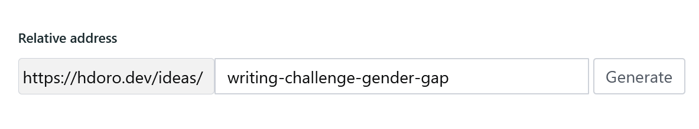

# sanity-plugin-better-slug

Editor friendly slug fields for your Sanity.io studio!



## Installation

Start by enabling it in your studio:

```
sanity install better-slug
```

Then, you can either use the type `better-slug` for your fields to carry that over, or just use the custom input component directly in your `slug` field:

```js
import SlugInput from 'sanity-plugin-better-slug'

export default {
  title: 'Testing Slugs',
  name: 'testing-slugs',
  type: 'document',
  fields: [
    {
      // RECOMMENDED: using Sanity's default _type: 'slug' w/ input component
      name: 'slug_regular_custom_input',
      type: 'slug',
      inputComponent: SlugInput,
      options: {
        source: 'title',
        basePath: 'https://site.url',
        // Use isUnique/maxLength just like you would w/ the regular slug field
        isUnique: MyCustomIsUniqueFunction,
        maxLength: 30,
      },
    },
    {
      // EASIER BUT NOT RECOMMENDED: using better-slug type
      // The issue with it is that you become dependant on this plugin forever.
      // Also, the isUnique behavior won't work as intended.
      name: 'slug_custom_type',
      type: 'better-slug',
      options: {
        basePath: 'https://site.url',
      },
    },
    {
      // If you want to customize how slugs are formatted
      name: 'slug_custom_format',
      type: 'slug',
      inputComponent: SlugInput,
      options: {
        basePath: 'https://site.url',
        slugify: (slugString) => slugString.toLowerCase(),
        // You could even avoid slugifying entirely by returning the full value:
        slugify: (slugString) => slugString,
      },
    },
    {
      // If you want to provide a custom path based on the current document:
      name: 'slug_function_path',
      type: 'slug',
      inputComponent: SlugInput,
      options: {
        basePath: (document) => `https://site.url/${document.lang}`,
        // It could even be a promise!
        basePath: async (document) => {
          const subPath = await getDocumentSubPath(document) // ficticious method
          return `https://site.url/${subPath}`
        },
      },
    },
  ],
}
```

## Roadmap

- [ ] get merged into `@sanity/base`
  - That's right! The goal of this plugin is to become obsolete. It'd be much better if the official type included in Sanity had this behavior from the get-go. Better for users and the platform :)